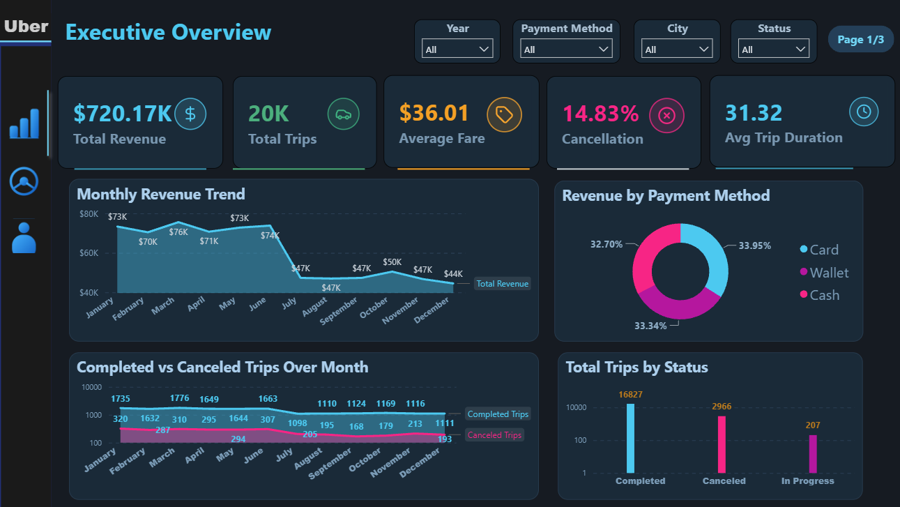
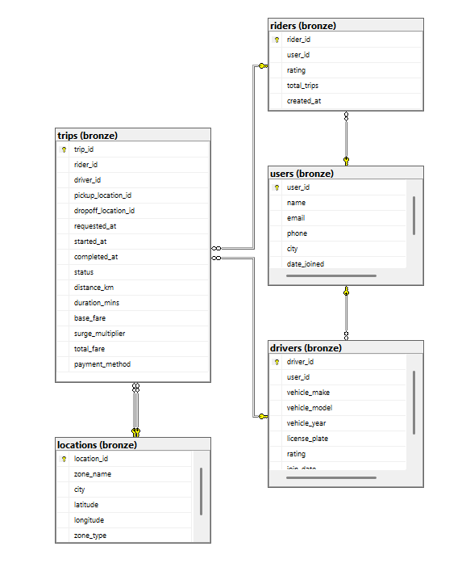
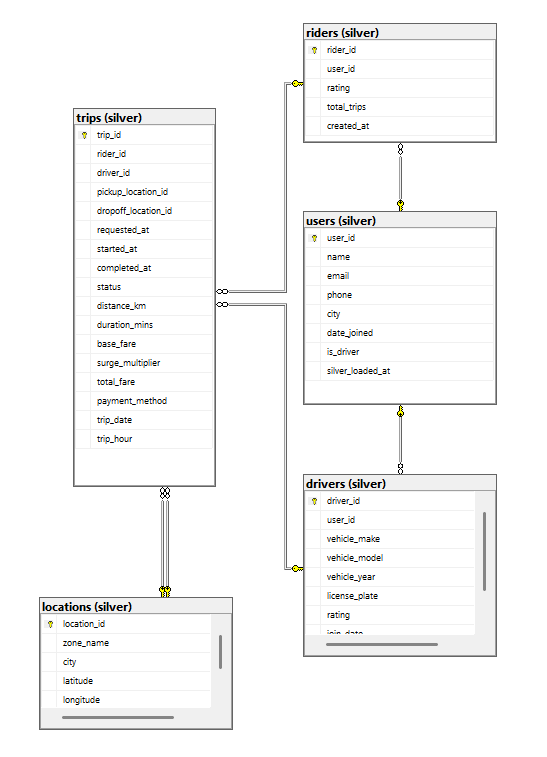
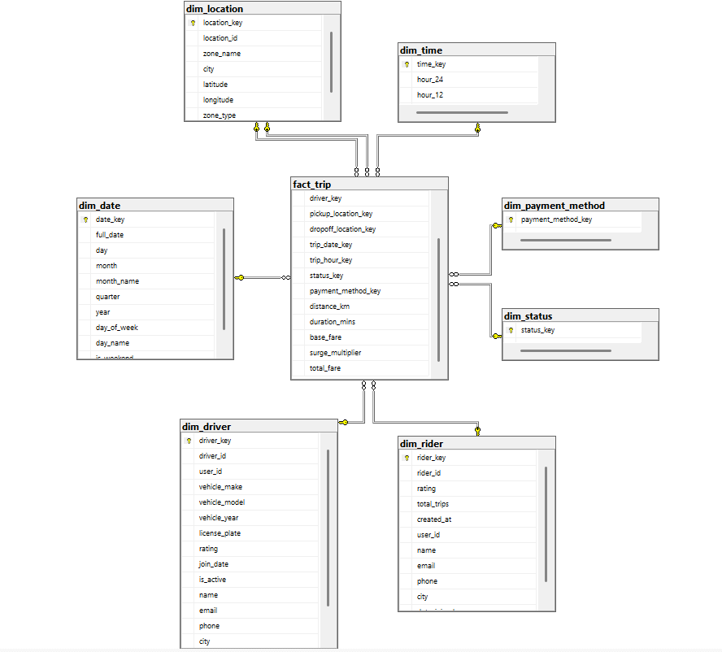
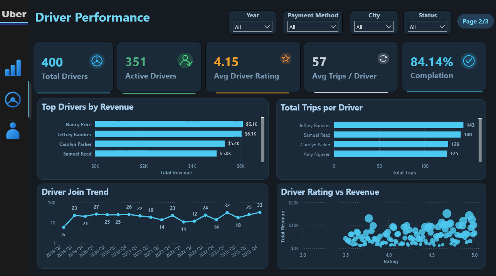
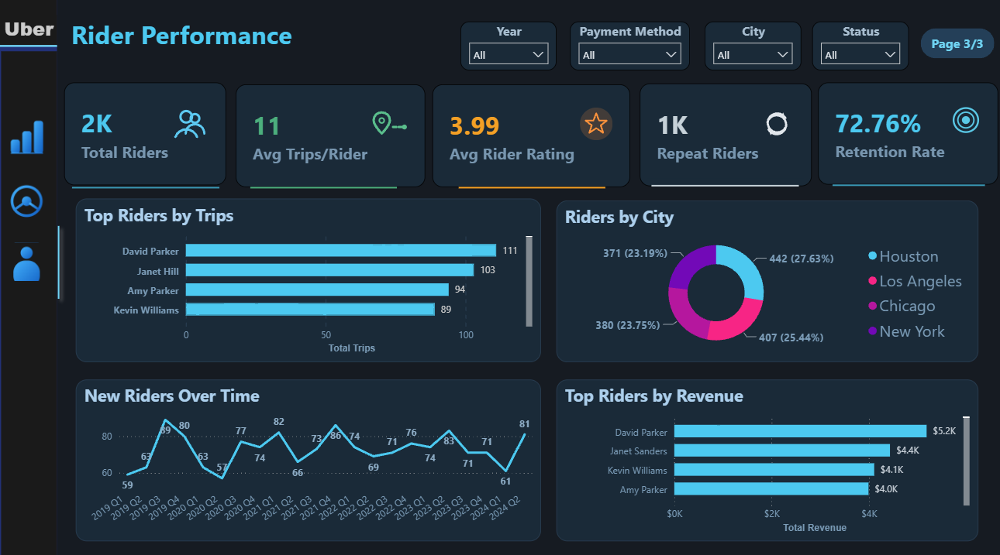
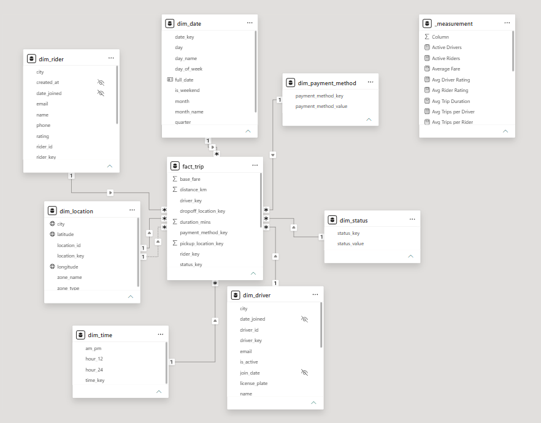

# 🚗 End-to-End Uber Data Warehouse

<p align="center">
  
</p>

<p align="center">


</p>

---

# 📖 Overview

This project demonstrates an **end-to-end Data Warehouse solution** for Uber ride analytics using **SQL Server**, **SSIS**, and **Power BI**.

The solution follows the **Medallion Architecture (Bronze → Silver → Gold)** and implements a **Star Schema** dimensional model optimized for analytical reporting.

The project simulates a production-grade analytics platform by ingesting raw CSV data, performing data cleansing and transformation, loading dimensional models through ETL pipelines, and delivering interactive business dashboards.

---

# ✨ Project Highlights

* End-to-End Data Warehouse Implementation
* Medallion Architecture (Bronze → Silver → Gold)
* Dimensional Modeling using Star Schema
* SQL Server Data Warehouse
* SSIS ETL Pipelines
* Power BI Interactive Dashboards
* Data Quality Validation Rules
* Production-Style Repository Structure
* Database Backup Included (`Uber_DWH.bak`)

---

# 🏢 Business Problem

Uber generates large volumes of operational data from:

* Riders
* Drivers
* Trips
* Locations
* Payments

Operational databases are optimized for transactions and day-to-day operations but are not designed for analytical workloads.

The objective of this project is to build a centralized analytical platform that enables:

* Revenue Reporting
* Driver Performance Analysis
* Rider Retention Analysis
* Trip Behavior Analytics
* Geographic Insights
* Executive Dashboards

---

# 🏗️ Solution Architecture

```text
CSV Files
    │
    ▼
┌──────────────┐
│    Bronze    │
│ Raw Staging  │
└──────┬───────┘
       │
       ▼
┌──────────────┐
│    Silver    │
│ Cleaned Data │
└──────┬───────┘
       │
       ▼
┌──────────────┐
│     SSIS     │
│ ETL Packages │
└──────┬───────┘
       │
       ▼
┌──────────────┐
│     Gold     │
│ Star Schema  │
└──────┬───────┘
       │
       ▼
┌──────────────┐
│   Power BI   │
│ Dashboards   │
└──────────────┘
```

---

# 📐 Medallion Architecture

| Layer  | Description                                     |
| ------ | ----------------------------------------------- |
| Bronze | Raw source data stored exactly as received      |
| Silver | Data cleansing, validation, and standardization |
| Gold   | Business-ready dimensional model for analytics  |

---

# 🥉 Bronze Layer

The Bronze layer stores source data without transformation and acts as the historical landing zone.

## Source Tables

* users
* drivers
* riders
* locations
* trips

## Characteristics

* Raw ingestion
* Historical preservation
* No transformations
* No validation
* Source-system structure maintained

<p align="center">

</p>

---

# 🥈 Silver Layer

The Silver layer focuses on data quality, cleansing, and standardization.

<p align="center">

</p>

## Data Quality Rules

### Users

* Trim whitespace
* Standardize names
* Lowercase emails
* Clean phone numbers
* Remove duplicate emails

### Drivers

* Remove duplicate license plates
* Validate ratings
* Standardize vehicle information

### Riders

* Correct invalid trip counts
* Handle missing values
* Validate ratings

### Locations

* Standardize city names
* Validate latitude range
* Validate longitude range

### Trips

* Handle invalid distances
* Handle invalid durations
* Validate timestamps

---

# 🥇 Gold Layer

The Gold layer implements a dimensional model optimized for reporting and analytics.

<p align="center">

</p>

---

# ⭐ Star Schema

```text
                           +-------------+
                           |  dim_date   |
                           +-------------+
                                  |
                                  |
+-------------+           +---------------+           +-------------+
| dim_driver  |-----------|               |-----------| dim_rider   |
+-------------+           |               |           +-------------+
                          |   fact_trip   |
+-------------+-----------|               |-----------+-------------+
| dim_status  |           |               |           | dim_payment |
+-------------+           +-------+-------+           +-------------+
                                  |
                           +-------------+
                           |  dim_time   |
                           +-------------+
                                  |
                    +-------------+-------------+
                    |                           |
         pickup_location_key        dropoff_location_key
                    |                           |
             +-------------+             +-------------+
             | dim_location|             | dim_location|
             +-------------+             +-------------+
```

---

# 📌 Fact Table Grain

One row in `fact_trip` represents:

> One completed or cancelled Uber trip.

---

# 📊 Fact Table

| Column               | Description      |
| -------------------- | ---------------- |
| trip_key             | Surrogate Key    |
| trip_id              | Business Key     |
| rider_key            | Rider Dimension  |
| driver_key           | Driver Dimension |
| pickup_location_key  | Pickup Location  |
| dropoff_location_key | Dropoff Location |
| date_key             | Date Dimension   |
| time_key             | Time Dimension   |
| fare_amount          | Trip Revenue     |
| distance_km          | Trip Distance    |
| duration_minutes     | Trip Duration    |

---

# 🔄 ETL Workflow

```text
Extract CSV Files
        │
        ▼
Load Bronze Tables
        │
        ▼
Transform Silver Tables
        │
        ▼
Load Dimensions
        │
        ▼
Load Fact Table
        │
        ▼
Power BI Reporting
```

---

# 📂 Repository Structure

```text
.
├── Uber_DWH.bak
├── data
│   └── raw
│       ├── raw_drivers.csv
│       ├── raw_locations.csv
│       ├── raw_riders.csv
│       ├── raw_trips.csv
│       └── raw_users.csv
│
├── sql
│   ├── 00_setup
│   │   ├── create_database.sql
│   │   └── create_schemas.sql
│   ├── 01_bronze
│   │   ├── create_bronze_tables.sql
│   │   └── load_bronze_data.sql
│   ├── 02_silver
│   │   ├── create_silver_tables.sql
│   │   ├── transform_drivers.sql
│   │   ├── transform_locations.sql
│   │   ├── transform_riders.sql
│   │   ├── transform_trips.sql
│   │   └── transform_users.sql
│   └── 03_gold
│       ├── create_gold_tables.sql
│       ├── dim_date.sql
│       ├── dim_driver.sql
│       ├── dim_location.sql
│       ├── dim_rider.sql
│       ├── dim_time.sql
│       └── fact_trip.sql
│
├── ssis
│   ├── dim_driver_v001.dtsx
│   ├── dim_location_v001.dtsx
│   ├── dim_rider_v001.dtsx
│   ├── fact_trip_v001.dtsx
│   ├── Package.dtsx
│   ├── Project.params
│   └── Uber_SSIS.dtproj
│
├── powerbi
│   └── Uber.pbix
│
├── docs
│   ├── architecture
│   │   ├── bronze.png
│   │   ├── silver.png
│   │   └── gold_DWH.png
│   ├── dashboards
│   │   ├── executive-overview.png
│   │   ├── driver-performance.png
│   │   ├── rider-performance.png
│   │   └── model_view.png
│   └── demo
│       └── uber-dashboard-demo.mp4
│
├── README.md
└── LICENSE
```

---

# 📊 Dashboard Pages

# Executive Overview

### KPIs

* Total Revenue
* Total Trips
* Average Fare
* Cancellation Rate
* Average Trip Duration

### Visuals

* Revenue Trend
* Revenue by Payment Method
* Trips by Status
* KPI Cards

<p align="center">

</p>

---

# Driver Performance

### KPIs

* Total Drivers
* Active Drivers
* Average Rating
* Completion Rate
* Trips per Driver

### Visuals

* Top Drivers by Revenue
* Driver Revenue Contribution
* Driver Ratings
* Driver Growth

<p align="center">

</p>

---

# Rider Performance

### KPIs

* Total Riders
* Average Trips per Rider
* Average Rating
* Repeat Riders
* Retention Rate

### Visuals

* Top Riders by Revenue
* Top Riders by Trips
* Riders by City
* New Rider Trend

<p align="center">

</p>

---

# Power BI Data Model

<p align="center">

</p>

---

# 🎥 Dashboard Demo

```text
docs/demo/uber-dashboard-demo.mp4
```

---

# 📈 Business Questions Answered

* How much revenue is generated over time?
* Which drivers generate the highest revenue?
* Which riders are most active?
* What are the peak operating hours?
* What are the cancellation trends?
* Which cities generate the most trips?
* What are the preferred payment methods?
* What is the average trip duration?
* What is the average trip distance?

---

# 🚀 How to Run

## Option 1 — Restore Database

```sql
RESTORE DATABASE Uber
FROM DISK = 'Uber_DWH.bak';
```

---

## Option 2 — Build From Scratch

### Setup

```text
sql/00_setup/create_database.sql
sql/00_setup/create_schemas.sql
```

### Bronze

```text
sql/01_bronze/create_bronze_tables.sql
sql/01_bronze/load_bronze_data.sql
```

### Silver

```text
sql/02_silver/create_silver_tables.sql
sql/02_silver/transform_users.sql
sql/02_silver/transform_drivers.sql
sql/02_silver/transform_riders.sql
sql/02_silver/transform_locations.sql
sql/02_silver/transform_trips.sql
```

### Gold

```text
sql/03_gold/create_gold_tables.sql
sql/03_gold/dim_date.sql
sql/03_gold/dim_time.sql
sql/03_gold/dim_driver.sql
sql/03_gold/dim_rider.sql
sql/03_gold/dim_location.sql
sql/03_gold/fact_trip.sql
```

---

# Run SSIS

Open:

```text
ssis/Uber_SSIS.dtproj
```

Deploy and execute the ETL packages.

---

# Open Power BI

Open:

```text
powerbi/Uber.pbix
```

Refresh the SQL Server connection.

---

# 🛠️ Technology Stack

| Technology             | Purpose                   |
| ---------------------- | ------------------------- |
| SQL Server             | Data Warehouse            |
| T-SQL                  | Data Transformation       |
| SSIS                   | ETL Development           |
| Power BI               | Reporting & Visualization |
| CSV Files              | Source Data               |
| Star Schema            | Dimensional Modeling      |
| Medallion Architecture | Data Platform Design      |

---

# 💡 Skills Demonstrated

* Data Warehousing
* Data Modeling
* ETL Development
* SQL Server
* T-SQL
* SSIS
* Power BI
* Data Validation
* Dimensional Modeling
* Business Intelligence
* KPI Development
* Analytical Reporting
* Medallion Architecture

---

# 📫 Connect With Me

**GitHub:** https://github.com/elmogyy

**LinkedIn:** https://www.linkedin.com/in/mahmoud-elmogy/

---

# 📄 License

This project is licensed under the MIT License.
